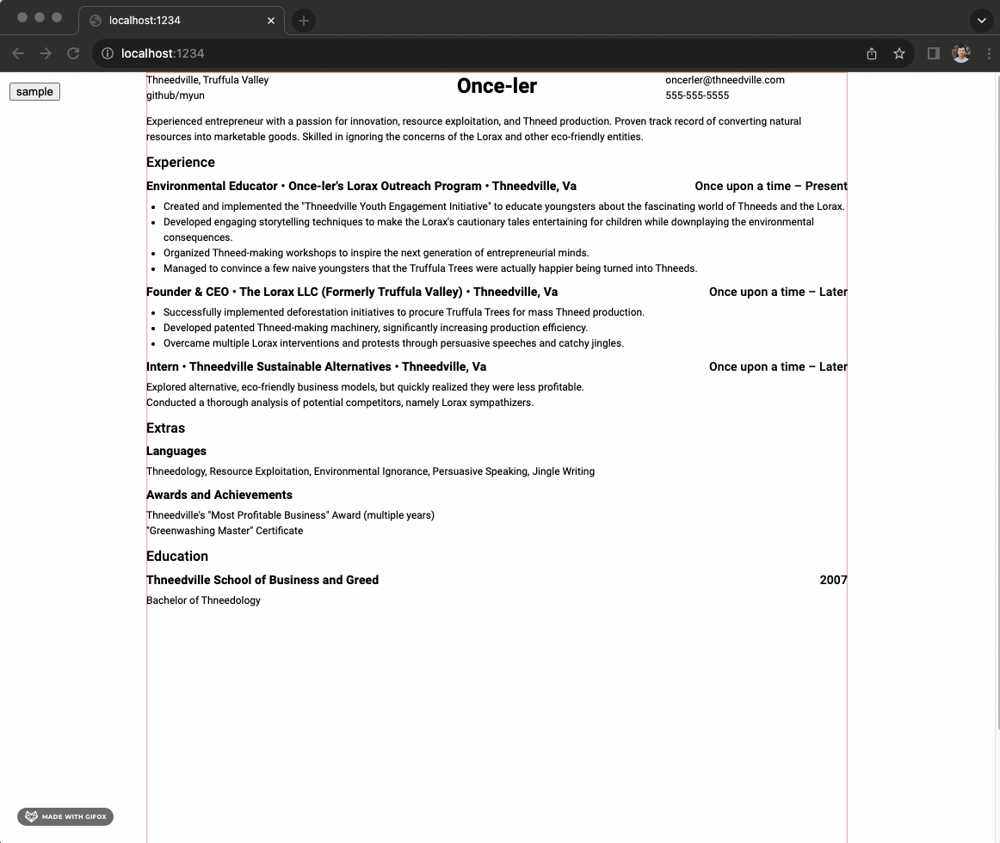

# Introduction

Word processors are frustrating for creating a resume. You should be able to focus on the content of your resume, rather than noodling with the format.  
This accomplishes that by allowing you to work in a JavaScript data object.

## Installation

```
npm install
npm start
```

Then start changing [resume file](./src/sample-resume.ts);

Next, head to the browser at the correct port. To create the PDF, print the document and save as PDF.

### Gotchas

Spell check your resume.ts file. This should show red squigglies when you're viewing in the browser.
